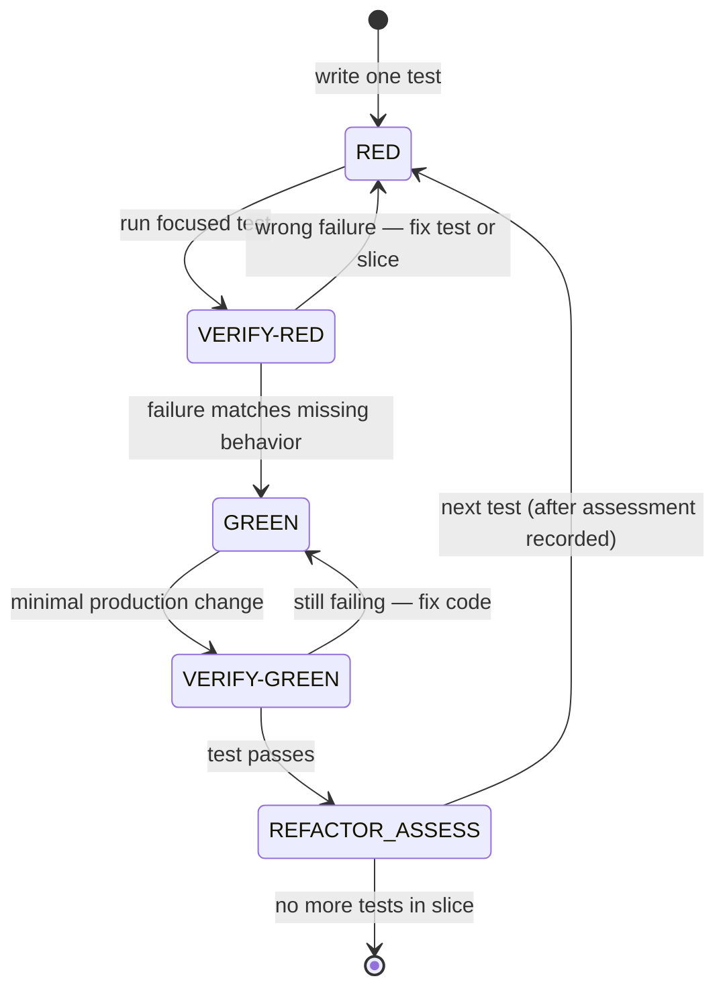

# Red → Green → Refactor

Procedure for TDD-marked tacos apply and for **tacos-work** when the user opts into TDD in prompt or Intent. Spirit aligns with common TDD practice (test first, smallest step, refactor with a green bar) — paraphrased here, not vendored.

## Iron law

**No production code without a failing test first** for behavioral slices.

Production code means code under test for the slice (application logic, API handlers, CLI behavior, etc.). Test code written to express the new behavior is allowed on Red.

Docs-only work (markdown, skill prose, comments with no executable delta) uses `Tests: N/A` with a one-line reason — not a license to skip tests on behavioral changes.

Apply-review pass 1 flags batched RED and missing refactor assessment as **BLOCKER** when `tdd.md` exists or tacos-work opted into TDD — see [tacos-apply-review](../../tacos-apply-review/references/spec-compliance-pass.md) ## TDD procedure (pass 1).

## Per-test atomic cycle

For TDD-marked apply and tacos-work TDD opt-in: **one test at a time** through a full cycle before starting the next test. Do not batch multiple RED steps or write production code before VERIFY-RED passes for the current test.



|Transition|Gate|Pass|Fail (stop and fix)|
|-|-|-|-|
|RED → VERIFY-RED|**VERIFY-RED**|Failure message matches missing behavior for this test|Wrong failure, flaky pass/fail, test never ran, or multiple new failing tests before first GREEN|
|GREEN → VERIFY-GREEN|**VERIFY-GREEN**|Same test passes; no unrelated tests broken|Still red, or new failures introduced|
|VERIFY-GREEN → REFACTOR assessment|—|Record assessment (see below) before next RED|Skipping assessment or starting next test while assessment pending|

**Refactor assessment (mandatory after VERIFY-GREEN):** Before RED for the next test, record in chat:

- **Action taken:** what you refactored and that tests stayed green, **or**
- **Not needed:** one-line reason (e.g. "smallest change already clean")

Same record applies at end of slice when no further tests remain.

### WRONG vs RIGHT — anti-batching

**WRONG — batched RED before first GREEN:**

```text
- [ ] Red: test A — empty filter returns CSV header only
- [ ] Red: test B — single row export
- [ ] Red: test C — invalid filter error
- [ ] Green: implement ExportService for all three
```

Violation: three failing tests exist before any GREEN/VERIFY-GREEN for test A. **Restart from test A only** — complete RED → VERIFY-RED → GREEN → VERIFY-GREEN → refactor assessment, then test B.

**RIGHT — atomic per-test cycle:**

```text
- [ ] Red: test A — empty filter returns CSV header only
- [ ] Green: minimal code until test A passes
- [ ] Refactor: (assessment recorded) — not needed; single method
- [ ] Red: test B — single row export
- [ ] Green: extend until test B passes
- [ ] Refactor: extract row formatter; tests green
```

Each test completes VERIFY-RED and VERIFY-GREEN (and refactor assessment) before the next RED begins.

## Red flags — STOP

If you catch yourself thinking any of the following, **stop** and restart from Red for the current slice:

- "I'll write the test after — it's faster"
- "Too simple to need a test"
- "Let me write tests for all cases first, then implement"
- "Test 1 passed RED-GREEN-REFACTOR — I'll batch the rest"
- "Green passes — Refactor is optional" (assessment is mandatory; skipping action is fine when recorded)
- "Hard to test, so skip Red and implement"
- "Reuse old failure output" (Red needs a fresh run for this slice)
- "`.skip` / `.todo` / comment-out to unblock"
- "Docs-only so no Red" when the slice changes executable behavior
- "I'll update the TC row expected result so Green passes" — committed scenarios are read-only; escalate QA via `/tacos-test-plans`
- "Small typo fix in test-cases.md is harmless" — any eng edit under `openspec/test-plans/` is forbidden (apply-review **BLOCKER**)

None of these justify production code without an observed failing test for the slice (unless the user explicitly waives in chat).

## Waiver recording

When the user explicitly waives red-paste evidence in chat, record the waiver **before** checking **Green**:

|Context|Record location|
|-|-|
|Change-folder **apply** (`tdd.md` under `openspec/changes/<name>/`)|`grill-summaries.md` ## apply|
|**tacos-work** session (`artifacts/tacos-work/<slug>/tasks.md`)|**Planning** or **## Work** inline note — work sessions MUST NOT use `grill-summaries.md`|

Detailed rebuttals: see **Rationalizations (do not accept)** below.

## Red from committed scenarios

When the change links `openspec/test-plans/<slug>/` (via optional `Test plan:` in `tdd.md`, or the same path in `proposal.md` / `design.md`):

1. Read `<slug>-test-cases.md` and optional `journeys.md` before authoring Red for the slice.
2. Align each Red test to one or more `TC-*` rows — cite the case id in the test name or slice note when practical.
3. Treat committed expected results as authoritative — combine with Jira/Figma/change specs; do not narrow or broaden acceptance in test code without a QA plan update.
4. When Red fails because committed scenario text disagrees with intended product behavior, **STOP** — report in chat; eng fixes code when the scenario is correct, or QA re-runs `/tacos-test-plans` when requirements changed. **Forbidden:** editing `openspec/test-plans/**` during apply to make tests pass.

Apply-review treats any eng diff under `openspec/test-plans/` as **BLOCKER** — see [checklist-pass1.md](../../tacos-apply-review/references/checklist-pass1.md) ## QA test plans (pass 1).

## Red

1. Write or extend **one** test that expresses the desired behavior for this slice.
2. Run the focused test command (host `AGENTS.md` **Commands** block).
3. Confirm failure is for the **right reason** (missing behavior), not typos, environment drift, or unrelated breakage.
4. Paste failing command output in chat before checking Green. Optional: save the same output under `artifacts/outputs/` — supplement only.

**Done-when:** Test fails predictably; user-visible paste in chat; Red checkbox may be checked.

## Green

1. Write the **smallest** production change that makes the test pass.
2. Run the same test (or focused subset); confirm pass.
3. Do not expand scope beyond the slice Requirement or cited design decision.

**Done-when:** Test passes; Green checkbox may be checked only after Red done-when is satisfied (or documented user waiver per **Waiver recording** above).

## Refactor

1. With tests green, improve names, structure, or duplication **without** changing observable behavior.
2. Re-run tests after each meaningful refactor step.
3. Keep the slice bounded — defer unrelated cleanup to a later slice or change.
4. **Record refactor assessment** per [Per-test atomic cycle](#per-test-atomic-cycle) before starting RED for the next test (or before closing the slice).

**Done-when:** Tests still green; refactor assessment recorded; Refactor checkbox may be checked.

## Verify red / verify green

These gates correspond to **VERIFY-RED** and **VERIFY-GREEN** in the [per-test state machine](#per-test-atomic-cycle). Run them after every RED and GREEN step for the **current** test only.

|Step|Pass|Fail (stop and fix)|
|-|-|-|
|Verify red (VERIFY-RED)|Failure message matches missing behavior|Wrong failure, flaky pass/fail, or test never ran|
|Verify green (VERIFY-GREEN)|Same test passes; no unrelated tests broken|Still red, or new failures introduced|

## Rationalizations (do not accept)

|Rationalization|Rebuttal|
|-|-|
|"Too simple to test"|Simple behavior still gets a test; complexity will arrive later without a harness.|
|"I'll add tests after Green"|Violates iron law; tail tests rarely match the slice that shipped.|
|"Hard to test, so skip Red"|Narrow the slice, extract a test seam, or ask the user — do not go straight to production code.|
|"Reuse old failure output"|Red requires a fresh run for **this** slice; pasted output must match current test and code.|
|"Green passes, Refactor optional"|Refactor is a separate checkbox — at minimum confirm no obvious debt before checking it off or waiving in chat.|
|"Integration test is enough"|Slice still needs a focused red on the unit under change unless the task row explicitly scopes integration-only.|
|"Docs-only so no Red"|Only when the slice is genuinely non-executable; use `Tests: N/A` with reason, not silent skip.|
|"Log file replaces chat paste"|Chat paste is required for reviewer visibility; logs are optional supplement only.|
